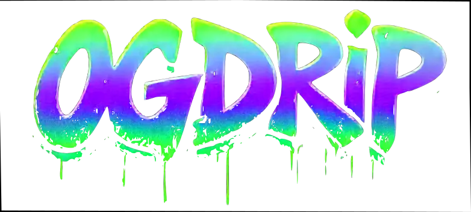

# Open Graph Generator (OG Drip)

Generate beautiful, customizable Open Graph images and metadata for your web content.



## Features

- Generate Open Graph images and meta tags for social media sharing
- Customizable templates and layouts
- Web-based UI for creating and managing Open Graph assets
- API for programmatic generation
- Multiple export options (PNG, HTML, ZIP)
- History tracking of generated assets

## Project Structure

This is a monorepo containing:

- **Frontend**: Astro + Svelte5 app
- **Backend**: Go API with Chrome automation
- **Shared**: TypeScript types shared between frontend and backend

## Quick Start

### Option 1: Run with Docker (Recommended)

The easiest way to run OG Drip is using Docker:

```bash
# Clone the repository
git clone https://github.com/yourusername/ogdrip.git
cd ogdrip

# Build and run with Docker
./docker-build/docker-build.sh
```

Once running, access:

- Frontend: http://localhost:3000
- Backend API: http://localhost:8888/api/health

### Option 2: Manual Setup

#### Prerequisites

- Node.js 18+
- Go 1.21+
- PNPM
- Chrome/Chromium browser

#### Steps

1. **Clone and set up the repository**

```bash
git clone https://github.com/yourusername/ogdrip.git
cd ogdrip
pnpm install
```

2. **Run the backend**

```bash
cd backend
go mod download
go build -o ogdrip-backend .
./ogdrip-backend -service
```

3. **Run the frontend**

```bash
cd frontend
pnpm install
pnpm dev
```

## Development Guide

### Build and Development Commands

**Frontend:**

```bash
cd frontend
pnpm install     # Install dependencies
pnpm dev         # Start development server
pnpm build       # Build for production
pnpm preview     # Preview production build
```

**Backend:**

```bash
cd backend
go mod download          # Download dependencies
go build -o ogdrip-backend .  # Build the binary
./ogdrip-backend -service     # Run API service
```

### Deployment to GitHub

1. Fork or clone this repository
2. Update the `.env.production` files with your configuration
3. Push your changes to GitHub
4. The project is ready to be deployed from GitHub using:
   - GitHub Actions
   - Coolify
   - Any Docker-based deployment platform

### Docker Deployment

1. Build the Docker images:

```bash
./docker-build/docker-build.sh
```

2. Push to your Docker registry:

```bash
docker tag ogdrip_frontend:latest yourusername/ogdrip-frontend:latest
docker tag ogdrip_backend:latest yourusername/ogdrip-backend:latest
docker push yourusername/ogdrip-frontend:latest
docker push yourusername/ogdrip-backend:latest
```

3. Deploy using docker-compose.production.yml

## API Documentation

OG Drip provides comprehensive API documentation through Swagger UI.

- **Interactive API Documentation**: Visit `/docs/` or `/swagger/` when the backend is running
- **OpenAPI Specification**: Available at `/api/openapi.yaml`

### Generate Open Graph Image and Meta Tags

```
POST /api/generate
```

**Parameters:**

- `url`: Target URL to capture
- `title`: Title for the OG image
- `description`: Description text
- `imageType`: Type of image (basic, gradient, etc)
- `width`: Image width in pixels (default: 1200)
- `height`: Image height in pixels (default: 630)

**Response:**

```json
{
  "success": true,
  "message": "Open Graph assets generated successfully",
  "image_url": "http://localhost:8888/files/image_id.png",
  "meta_tags_url": "http://localhost:8888/files/meta_id.html",
  "zip_url": "http://localhost:8888/api/download-zip?file=image_id.png&file=meta_id.html",
  "html_content": "...",
  "id": "unique_identifier"
}
```

## Configuration

See [DEPLOYMENT.md](DEPLOYMENT.md) and [LOCAL_DEPLOYMENT.md](LOCAL_DEPLOYMENT.md) for detailed
configuration options.

## License

[MIT License](LICENSE)

## Acknowledgments

- [Chromedp](https://github.com/chromedp/chromedp) for headless browser automation
- [Astro](https://astro.build/) for the frontend framework
- [Svelte](https://svelte.dev/) for reactive UI components
